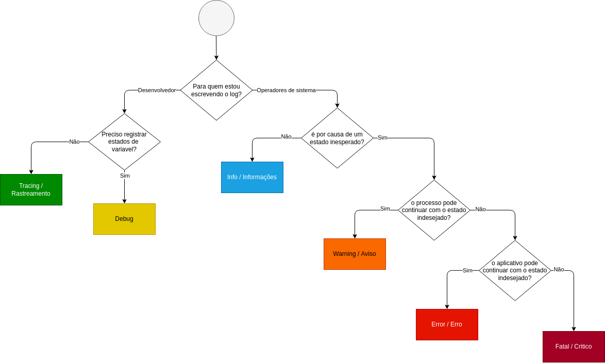

# O que são logs?

Log é um texto que registra um evento relevante em uma aplicação, como se fosse uma caixa preta e justamente por isso precisa de uma atenção.

Por exemplo, se ocorrer um erro ou sua aplicação decidir funcionar de maneira estranha, como você saberia o fluxo que foi tomado? Onde parou, porque parou? 

Em um cenário complexo os logs são úteis. Com eles você poderá percorrê-los e descobrir onde exatamente o aplicativo está tendo problemas e como você pode replicar esses problemas.

Ao reproduzir o problema, você pode se aprofundar e encontrar uma solução razoável para os erros. Algo que poderia levar várias horas para detectar pode levar apenas alguns minutos para diagnosticar.

# Níveis de log

Os logs possuem uma vantagem enorme perto do famoso comando "print", que são os níveis de log.

Afinal porque se preocupar com esses níveis? Porque com isso é possível filtrar as mensagens e ver somente o que faz sentido quando se está monitorando uma aplicação. 

Esses níveis também representam prioridade e os níveis mais comuns são:

- [Fatal/Crítico](01-fatal.md)
- [Error/Erro ](02-error.md)
- [Warning/Aviso](03-warning.md)
- [Info/Informações](04-info.md)
- [Debug](05-debug.md)
- [Tracing/ Rastreamento](06-trace.md)

# Como definir o nível de log?

A próxima pergunta que você provavelmente já está fazendo é como entender os níveis de log em seus eventos de log.

Não existe uma receita pronta para isso, mas podemos pensar na definição de acordo com a gravidade.

Aqui tem um modelo que você pode usar como "base". Mesmo com uma convenção em vigor, em uma equipe de vários desenvolvedores, provavelmente não obteremos o nível de log para todas as mensagens corretamente na primeira vez.

Haverá mensagens de ERRO que deveriam ser mensagens de AVISO porque nada foi quebrado ainda. E haverá erros escondidos nas mensagens INFO, dando-nos uma falsa sensação de segurança.

Por isso deve haver algum tipo de alerta nos níveis WARN e ERROR e alguém responsável para agir sobre isso.

Mesmo em um ambiente de pré-produção, queremos saber o que está sendo relatado em WARN e ERROR para poder corrigir as coisas antes de entrar em produção.

# Exemplos de uso

- [PHP](./exemplos/php.md)

# Boas práticas

- Seja específico: os logs devem fornecer informações específicas e detalhadas sobre o que está acontecendo na aplicação.
- Use um formato padronizado: os logs devem seguir um formato padronizado, de modo que seja fácil encontrar e ler as informações.
- Adicione contexto: inclua informações adicionais, como o nome do usuário ou o ID da solicitação, para fornecer contexto aos logs.
- Seja consistente: use o mesmo formato e os mesmos termos para descrever eventos semelhantes.
- Use níveis de log adequados: utilize os níveis de log (como "debug", "info" e "error") de maneira apropriada para ajudar a identificar facilmente problemas.
- Não exponha informações confidenciais: certifique-se de que os logs não contenham informações confidenciais ou sensíveis.
- Armazene os logs de maneira segura: os logs podem conter informações importantes sobre o funcionamento da aplicação, por isso é importante armazená-los de maneira segura.
- Mantenha os logs atualizados: verifique regularmente os logs e mantenha-os atualizados para garantir que eles estejam sempre atualizados e relevantes.
  
# Escrevi meu log e agora?

O que precisamos fazer agora é a funcionalidade de alerta. Alerta é uma ferramenta muito poderosa, mas pode ser esmagadora. Os alertas devem ser acionáveis. Isso significa que um alerta deve ser um alerta se alguém precisar executar uma ação sobre ele fazendo algo. 

Por exemplo, remova arquivos de um dispositivo para evitar atingir 100% de utilização do disco.

Se os logs de seu aplicativo usarem bem os níveis de log, você poderá criar alertas em todas as mensagens de nível de log CRÍTICO. Como já mencionamos, o nível de log CRITICAL significa que a parte crucial do aplicativo não está funcionando e não estamos entregando uma lógica de negócios, portanto, uma falha total. 

# Agregação de logs

A coleção ou agregação de logs é o processo de coleta de logs de vários sistemas, extraindo dados estruturados e reunindo-os em um formato facilmente pesquisável

Você também pode criar alertas em mensagens de nível de log de ERRO, mas isso depende muito da funcionalidade. Por exemplo, no Grafana, podemos facilmente criar um alerta para qualquer evento de log que tenha um nível de log CRÍTICO:

- Grafana Loki - [https://grafana.com/logs/](https://grafana.com/logs/)
- New Relic [https://newrelic.com/platform/log-management](https://newrelic.com/platform/log-management)
- Data Dog [https://www.datadoghq.com/dg/logs/benefits-na-b/](https://www.datadoghq.com/dg/logs/benefits-na-b/)
- Dynatrace [https://www.dynatrace.com/monitoring/platform/log-monitoring/](https://www.dynatrace.com/monitoring/platform/log-monitoring/)